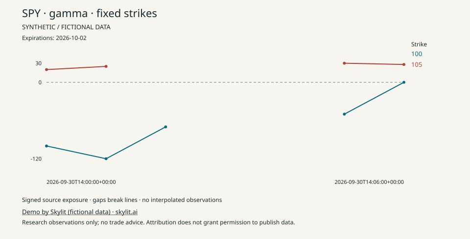
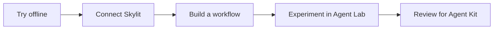

# Skylit Agent Kit

## Copy. Paste. Start.

**Click the copy button on this box, then paste it into your coding agent.** It will guide setup and show you a chart before you need an API key.

```text
Get me started with https://github.com/SkylitAI/skylit-agent-kit. In a repository-scoped session, read AGENTS.md and docs/start-here.md before running commands. Handle setup, run the offline node-tracker demo, and show me the chart. Use docs/capabilities.md to help me choose and build my next workflow. Keep private vaults out and never request credentials in chat. Use live calls only within my authorized budget; publish only with my authorization.
```

Use a coding agent that can run local commands. Repository access is required while the kit is internal; the agent can check Git and Python 3.11+ and guide any setup. **No Skylit API key is needed for the first demo.** Agent subscriptions may have their own costs. [Start here](docs/start-here.md) · [Everything you can use](docs/capabilities.md) · [Codex](agents/codex/README.md) · [Claude](agents/claude/README.md).

**Status:** offline examples work; live paths are synthetic-tested, with authenticated certification pending. Build useful research workflows using public Skylit contracts. [Remaining work](docs/roadmap.md).

## Prefer the terminal?

Requires Git and Python 3.11 or newer. No packages, account, API key or model are needed for the sample. On Windows, use `py -3` if `python3` is unavailable.

```sh
git clone https://github.com/SkylitAI/skylit-agent-kit.git
cd skylit-agent-kit
python3 -m skylit_agent_kit sample
```

You get a short, clearly labeled **fictional** research brief with calculations, sources, gaps and zero usage costs. [See the expected output](examples/expected-brief.md).

Change a number in `examples/fixtures/demo.json` and run again. Try setting a value to `null` to see how the report handles missing information.

## See a strike change over time

```sh
python3 -m skylit_agent_kit use-case node-tracker
```

Open the printed Markdown and SVG paths in `reports/`. The **fictional, zero-cost** chart follows exact strikes through signed exposure changes and missing observations; it never follows a moving king label as if it were the same strike.



[Four runnable workflows](docs/use-cases.md) cover fixed-strike replay, dated prices beside source levels, flow investigation and volatility context. They default to offline fixtures. Live replay costs 25 documented credits and requires an explicit budget increase; the other recipes reserve 2–4 credits. Each guide shows its exact plan and evidence limits.

## Explore any public endpoint

```sh
python3 -m skylit_agent_kit endpoints
python3 -m skylit_agent_kit endpoint heatseeker.getHeatmap
```

All **77 operations** have a synthetic request/response preview: 74 JSON, two bounded SSE streams and one plain-text clock. These demonstrate public contract shapes; the four workflows above turn selected responses into useful reports. [Endpoint guide](docs/endpoint-demos.md) · [Complete audit and ready commands](docs/endpoint-audit.md). Live mode is explicit; one conflicting Tempest history price remains blocked pending clarification.

## Real GEX/VEX and recent flow

Start with a free, offline plan for **SPXW, SPY, QQQ, TSLA, MSFT, AAPL, AMZN and META**:

```sh
python3 -m skylit_agent_kit watchlist --dry-run
```

When you want this run to use your Skylit account:

```sh
python3 -m skylit_agent_kit watchlist --live --output reports/watchlist.md
```

If needed, the terminal asks for your API key with typing hidden. Create it in your [Skylit Developer page](https://app.skylit.ai/developer); never paste it into an agent chat. No packages or model API key are required. The standard eight-symbol plan uses **12 requests / 10 documented credits** when your account allows a single heatmap batch. The program checks account access, balance, symbol support and the complete plan before paid calls, then runs once without retries. Unsupported or missing symbols stay visible; SPXW is never replaced with SPX.

The compact report shows source GEX/VEX nodes and recent flow, with separate board/trade times. This is implemented against the [public API contracts](docs/live-watchlist.md), with synthetic tests; a real account run has not yet been certified.

Suggested agent prompt:

> Run the watchlist dry-run for SPXW, SPY, QQQ, TSLA, MSFT, AAPL, AMZN and META. Explain the cost. When I ask for the live run, use the existing secure environment or guide me to the hidden terminal key prompt. Keep the default caps, report unavailable data explicitly, and show a compact report. Do not ask me to paste a key into chat.

## Choose your next step

| I want to… | Start here |
|---|---|
| Plot fixed strikes or try four research workflows | [Runnable use cases](docs/use-cases.md) |
| Explore a particular public API operation | [All 77 endpoint demos](docs/endpoint-audit.md) |
| Understand the data and build more | [Reading hints, guardrails and extensions](docs/using-watchlist-data.md) |
| Get GEX/VEX and recent flow | [Bounded watchlist guide](docs/live-watchlist.md) |
| Run and customize the sample | [Quickstart](docs/quickstart.md) |
| Connect Claude Desktop | [Claude guide](agents/claude/README.md) |
| Connect Codex | [Codex guide and config template](agents/codex/README.md) |
| Verify my Skylit account access | [Live account example](examples/README.md) |
| Explore free sources and tools | [Toolkit catalogue](tools/README.md) |
| Build the live Ticker Investigator | [Workflow contract](workflows/ticker-investigator/README.md) |
| Contribute a fix or experiment | [Contribution guide](CONTRIBUTING.md) |



## What belongs here

This kit holds maintained examples, shared helpers, agent setup guides and tested workflows. [Skylit Agent Lab](https://github.com/SkylitAI/skylit-agent-lab) is the home for community experiments. A useful experiment can graduate through a reviewed kit pull request.

The code license does not include Skylit service access or third-party data rights. Free sources can have usage limits, and your agent or model may have its own costs. Check current access in the [Skylit Developer page](https://app.skylit.ai/developer) and [official docs](https://www.skylit.ai/docs/api-reference/getting-started).

## Develop

```sh
python3 -m unittest discover -s tests -v
python3 -m compileall -q skylit_agent_kit tests
```

The runtime and tests use only Python's standard library. Run from the repository root; installation into site-packages is not required. See the [support matrix](docs/compatibility.md), [security guidance](SECURITY.md) and [roadmap](docs/roadmap.md).
