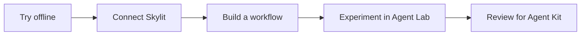

# Skylit Agent Kit

Build useful research workflows with Skylit's API and MCP, starting with a small example you can read, run and change.

**Status: starter foundation.** The offline demo works today. Live account lookup is implemented and tested with fixtures. Live research, the full free toolkit, and end-to-end host certification are still on the [roadmap](docs/roadmap.md).

## Your first result

Requires Git and Python 3.11 or newer. No packages, account, API key or model are needed for the sample. On Windows, use `py -3` if `python3` is unavailable.

```sh
git clone https://github.com/SkylitAI/skylit-agent-kit.git
cd skylit-agent-kit
python3 -m skylit_agent_kit sample
```

You get a short, clearly labeled **fictional** research brief with calculations, sources, gaps and zero usage costs. [See the expected output](examples/expected-brief.md).

Change a number in `examples/fixtures/demo.json` and run again. Try setting a value to `null` to see how the report handles missing information.

## Choose your next step

| I want to… | Start here |
|---|---|
| Run and customize the sample | [Quickstart](docs/quickstart.md) |
| Connect Claude Desktop | [Claude guide](agents/claude/README.md) |
| Connect Codex | [Codex guide and config template](agents/codex/README.md) |
| Verify my Skylit account access | [Live account example](examples/README.md) |
| Explore free sources and tools | [Toolkit catalogue](tools/README.md) |
| Build the live Ticker Investigator | [Workflow contract](workflows/ticker-investigator/README.md) |
| Contribute a fix or experiment | [Contribution guide](CONTRIBUTING.md) |



## What belongs here

This kit holds maintained examples, shared helpers, agent setup guides and tested workflows. [Skylit Agent Lab](https://github.com/SkylitAI/skylit-agent-lab) is the home for community experiments. A useful experiment can graduate through a reviewed kit pull request.

The code license does not include Skylit service access or third-party data rights. Free sources can have usage limits, and your agent or model may have its own costs. Check current access in the [Skylit Developer page](https://app.skylit.ai/developer) and [official docs](https://www.skylit.ai/docs/api-reference/getting-started).

## Develop

```sh
python3 -m unittest discover -s tests -v
python3 -m compileall -q skylit_agent_kit tests
```

The runtime and tests use only Python's standard library. Run from the repository root; installation into site-packages is not required. See the [support matrix](docs/compatibility.md), [security guidance](SECURITY.md) and [roadmap](docs/roadmap.md).
