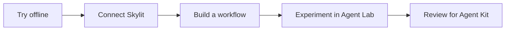

# Skylit Agent Kit

## Copy. Paste. Connect.

**Click the copy button on this box, then paste it into your coding agent.** It shows you the five steps below, checks your setup, connects your Skylit account, proves the connection and shows you live data.

```text
Get me connected with https://github.com/SkylitAI/skylit-agent-kit. In a repository-scoped session, read AGENTS.md and docs/start-here.md before running commands. First show me what to expect, then run doctor, guide me to create my Skylit API key and store it with the login command in my own terminal (never in chat), then prove the connection with the welcome check. After that, offer the smallest live result and ask before spending any credits. Use docs/capabilities.md to help me choose my next workflow. Keep private vaults out.
```

Use a coding agent that can run local commands, such as Claude Code or Codex. You need Git, Python 3.11+ and a Skylit membership with API access (paid plan or invite code); the agent checks the first two and walks you through the key. Agent subscriptions may have their own costs. [Start here](docs/start-here.md) · [Everything you can use](docs/capabilities.md) · [Claude](agents/claude/README.md) · [Codex](agents/codex/README.md).

**Available now:** a one-time key login, a connection check, four research workflows, a watchlist runner and 77 endpoint previews. Live paths have synthetic tests; authenticated service checks and host certification are still pending. [Verification status](docs/compatibility.md) · [Remaining work](docs/roadmap.md).

## What to expect

1. **Check setup** (agent): runs `doctor`. Offline; one line per prerequisite.
2. **Create a key** (you): Developer page → API keys → New key, in the browser. Shown once; never paste it into chat.
3. **Store the key** (you): `python3 -m skylit_agent_kit login` in your own terminal. Hidden prompt; stored on this computer.
4. **Prove the connection** (agent): runs `account --welcome`. One free account check; shows Connected to Skylit with your credits.
5. **First live data** (agent, after you say yes): fetches one SPY gamma heatmap. Real strikes nearest spot with their timestamp; 1 credit.

**Nothing spends credits before step 5, and step 5 waits for your yes.**

The agent shows this path before it starts and marks your progress each time it runs `doctor`. Steps 2 and 3 are yours, because only you should handle the key.

## Prefer the terminal?

Requires Git and Python 3.11 or newer; no Python packages. On Windows, use `py -3` if `python3` is unavailable.

```sh
git clone https://github.com/SkylitAI/skylit-agent-kit.git
cd skylit-agent-kit
python3 -m skylit_agent_kit doctor
python3 -m skylit_agent_kit login
python3 -m skylit_agent_kit account --welcome
```

1. `doctor` checks your setup offline, marks where you are on the five steps and prints one next step.
2. `login` asks for your API key with typing hidden and stores it (macOS Keychain, or an owner-only file elsewhere). Create the key under **API keys** on your [Skylit Developer page](https://app.skylit.ai/developer); it is shown once. Never paste it into an agent chat.
3. `account --welcome` makes one free account request and shows **Connected to Skylit** with your remaining credits and rate limit.

Then fetch your first live data — one SPY gamma heatmap for **1 credit**:

```sh
python3 -m skylit_agent_kit endpoint heatseeker.getHeatmap --param symbols=SPY --param metric=gamma --live
```

It prints a short summary first (spot, the board's timestamp, the five strikes nearest spot and **Data: Skylit**), followed by the full JSON response.

[Four runnable workflows](docs/use-cases.md) cover strike changes, prices beside exposure levels, flow and volatility context. The [capability map](docs/capabilities.md) lists every command, its live cost and current limits.

## No API access yet?

Everything also runs offline on fictional data with zero service calls, so you can see what you'll get:

```sh
python3 -m skylit_agent_kit use-case node-tracker
```

Open the printed `Saved chart` and `Saved report` paths. The chart follows the same strikes over time, showing signed exposure changes and gaps where observations are missing.


For a small calculation example you can edit, try the [sample quickstart](docs/quickstart.md#also-try-the-small-calculation-sample).

## Explore any public endpoint

```sh
python3 -m skylit_agent_kit endpoints
python3 -m skylit_agent_kit endpoint heatseeker.getHeatmap
```

All **77 operations** have fictional request/response previews. They show API shapes; changing a preview parameter does not recompute its response. Live mode requires `--live` and explicit inputs. Tempest history live mode remains blocked by conflicting published prices. [Endpoint guide](docs/endpoint-demos.md) · [Every endpoint and its command](docs/endpoint-audit.md).

## Plan a GEX/VEX and flow watchlist

Start with a free, offline plan for **SPXW, SPY, QQQ, TSLA, MSFT, AAPL, AMZN and META**:

```sh
python3 -m skylit_agent_kit watchlist --dry-run
```

The standard plan reserves **10 documented credits and 12 requests**, including account checks, when your account allows one heatmap batch. The dry run uses no key or network. When you want to use your Skylit account:

```sh
python3 -m skylit_agent_kit watchlist --live --output reports/watchlist.md
```

It uses the key you stored with `login` (or `SKYLIT_API_KEY`); with neither, an interactive terminal asks for it with typing hidden. Never paste a key into an agent chat. No key yet? Follow the [API-key steps](docs/start-here.md#2-create-your-api-key-you-in-the-browser).

The runner checks access, balance, symbol support and the complete plan before paid calls. It runs once without retries or automatic budget increases.

The report separates board and trade timestamps and labels unavailable data. SPXW is never replaced with SPX. **Authenticated verification is pending.** See the [watchlist guide](docs/live-watchlist.md) for limits and expected output.

Suggested agent prompt:

> Run the watchlist dry-run for SPXW, SPY, QQQ, TSLA, MSFT, AAPL, AMZN and META. Explain the cost. When I ask for the live run, use my stored key; if none is found, tell me to run login in my terminal. Keep the default caps, report unavailable data explicitly, and show a compact report. Do not ask me to paste a key into chat.

## Choose your next step

| I want to… | Start here |
|---|---|
| Understand the data and build more | [Reading hints, guardrails and extensions](docs/using-watchlist-data.md) |
| Run and customize the sample | [Quickstart](docs/quickstart.md) |
| Connect Claude Desktop | [Claude guide](agents/claude/README.md) |
| Connect Codex | [Codex guide and config template](agents/codex/README.md) |
| Verify my Skylit account access | [Live account example](examples/README.md) |
| Explore free sources and tools | [Toolkit catalogue](tools/README.md) |
| Help build the planned Skylit + SEC brief | [Ticker Investigator proposal](workflows/ticker-investigator/README.md) |
| Contribute a fix or experiment | [Contribution guide](CONTRIBUTING.md) |



## What belongs here

This kit holds maintained examples, shared helpers, agent setup guides and tested workflows. [Skylit Agent Lab](https://github.com/SkylitAI/skylit-agent-lab) provides a runnable template and contribution checks for experiments. A useful experiment can graduate through a reviewed kit pull request. Both repositories are currently internal.

The code license does not include Skylit service access or third-party data rights. Free sources can have usage limits, and your agent or model may have its own costs. Check current access in the [Skylit Developer page](https://app.skylit.ai/developer) and [official docs](https://www.skylit.ai/docs/api-reference/getting-started).

## Develop

```sh
python3 -m unittest discover -s tests -v
python3 -m compileall -q skylit_agent_kit tests
```

The runtime and tests use only Python's standard library. Run from the repository root; installation into site-packages is not required. See the [support matrix](docs/compatibility.md), [security guidance](SECURITY.md) and [roadmap](docs/roadmap.md).

## License and release review

Original kit code and documentation use the [MIT license](LICENSE). API access, API Data, upstream specifications, exchange/provider data and trademarks retain their own terms. Each user supplies their own key. See the [source and dependency inventory](THIRD_PARTY.md).

Shared live-data reports include **Data: Skylit** with a link; preserve this credit and any source notices. Attribution does not grant redistribution rights. See the [API Terms](https://www.skylit.ai/api-terms) before sharing, especially for bulk, scheduled, real-time or commercial use.

**Public release remains gated** on confirmed legal ownership and permission to redistribute the bundled contracts and their generated derivatives. [Release readiness](docs/release-readiness.md) also records pending reviewer, private reporting and GitHub security settings. Passing offline tests does not resolve these gates or certify live integrations.
