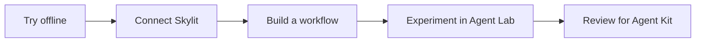

# Skylit Agent Kit

## Copy. Paste. Start.

**Click the copy button on this box, then paste it into your coding agent.** It will guide setup and show you a chart before you need an API key.

```text
Get me started with https://github.com/SkylitAI/skylit-agent-kit. In a repository-scoped session, read AGENTS.md and docs/start-here.md before running commands. Handle setup, run the offline node-tracker demo, and show me the chart. Use docs/capabilities.md to help me choose and build my next workflow. Keep private vaults out and never request credentials in chat. Use live calls only within my authorized budget; publish only with my authorization.
```

Use a coding agent that can run local commands. Repository access is required while the kit is internal; the agent can check Git and Python 3.11+ and guide any setup. **No Skylit API key is needed for the first demo.** Agent subscriptions may have their own costs. [Start here](docs/start-here.md) · [Everything you can use](docs/capabilities.md) · [Codex](agents/codex/README.md) · [Claude](agents/claude/README.md).

**Available now:** an offline chart, four research workflows, a watchlist runner and 77 endpoint previews. Live paths have synthetic tests; authenticated service checks and host certification are still pending. [Verification status](docs/compatibility.md) · [Remaining work](docs/roadmap.md).

## Prefer the terminal?

Requires Git and Python 3.11 or newer. No Python packages, Skylit account, API key or model are needed for the demo. On Windows, use `py -3` if `python3` is unavailable.

```sh
git clone https://github.com/SkylitAI/skylit-agent-kit.git
cd skylit-agent-kit
python3 -m skylit_agent_kit use-case node-tracker
```

Open the printed `Saved chart` and `Saved report` paths. The chart uses **fictional data and zero service calls**. It follows the same strikes over time, showing signed exposure changes and gaps where observations are missing.


[Four runnable workflows](docs/use-cases.md) cover strike changes, prices beside exposure levels, flow and volatility context. All start offline. The [capability map](docs/capabilities.md) lists commands, live costs and current limits. For a small calculation example you can edit, try the [sample quickstart](docs/quickstart.md#also-try-the-small-calculation-sample).

## Explore any public endpoint

```sh
python3 -m skylit_agent_kit endpoints
python3 -m skylit_agent_kit endpoint heatseeker.getHeatmap
```

All **77 operations** have fictional request/response previews. They show API shapes; changing a preview parameter does not recompute its response. Live mode requires `--live` and explicit inputs. Tempest history live mode remains blocked by conflicting published prices. [Endpoint guide](docs/endpoint-demos.md) · [Every endpoint and its command](docs/endpoint-audit.md).

## Plan a GEX/VEX and flow watchlist

Start with a free, offline plan for **SPXW, SPY, QQQ, TSLA, MSFT, AAPL, AMZN and META**:

```sh
python3 -m skylit_agent_kit watchlist --dry-run
```

The standard plan reserves **10 documented credits and 12 requests**, including account checks, when your account allows one heatmap batch. The dry run uses no key or network. When you want to use your Skylit account:

```sh
python3 -m skylit_agent_kit watchlist --live --output reports/watchlist.md
```

If needed, the terminal asks for your API key with typing hidden; never paste it into an agent chat. Create a key under **API keys** on your [Skylit Developer page](https://app.skylit.ai/developer). Access requires a paid membership or invite code, plus accepting the API Terms once. Follow the [API-key steps](docs/start-here.md#getting-an-api-key-user-steps).

The runner checks access, balance, symbol support and the complete plan before paid calls. It runs once without retries or automatic budget increases.

The report separates board and trade timestamps and labels unavailable data. SPXW is never replaced with SPX. **Authenticated verification is pending.** See the [watchlist guide](docs/live-watchlist.md) for limits and expected output.

Suggested agent prompt:

> Run the watchlist dry-run for SPXW, SPY, QQQ, TSLA, MSFT, AAPL, AMZN and META. Explain the cost. When I ask for the live run, use the existing secure environment or guide me to the hidden terminal key prompt. Keep the default caps, report unavailable data explicitly, and show a compact report. Do not ask me to paste a key into chat.

## Choose your next step

| I want to… | Start here |
|---|---|
| Understand the data and build more | [Reading hints, guardrails and extensions](docs/using-watchlist-data.md) |
| Run and customize the sample | [Quickstart](docs/quickstart.md) |
| Connect Claude Desktop | [Claude guide](agents/claude/README.md) |
| Connect Codex | [Codex guide and config template](agents/codex/README.md) |
| Verify my Skylit account access | [Live account example](examples/README.md) |
| Explore free sources and tools | [Toolkit catalogue](tools/README.md) |
| Help build the planned Skylit + SEC brief | [Ticker Investigator proposal](workflows/ticker-investigator/README.md) |
| Contribute a fix or experiment | [Contribution guide](CONTRIBUTING.md) |



## What belongs here

This kit holds maintained examples, shared helpers, agent setup guides and tested workflows. [Skylit Agent Lab](https://github.com/SkylitAI/skylit-agent-lab) provides a runnable template and contribution checks for experiments. A useful experiment can graduate through a reviewed kit pull request. Both repositories are currently internal.

The code license does not include Skylit service access or third-party data rights. Free sources can have usage limits, and your agent or model may have its own costs. Check current access in the [Skylit Developer page](https://app.skylit.ai/developer) and [official docs](https://www.skylit.ai/docs/api-reference/getting-started).

## Develop

```sh
python3 -m unittest discover -s tests -v
python3 -m compileall -q skylit_agent_kit tests
```

The runtime and tests use only Python's standard library. Run from the repository root; installation into site-packages is not required. See the [support matrix](docs/compatibility.md), [security guidance](SECURITY.md) and [roadmap](docs/roadmap.md).

## License and release review

Original kit code and documentation use the [MIT license](LICENSE). API access, API Data, upstream specifications, exchange/provider data and trademarks retain their own terms. Each user supplies their own key. See the [source and dependency inventory](THIRD_PARTY.md).

Shared live-data reports include **Data: Skylit** with a link; preserve this credit and any source notices. Attribution does not grant redistribution rights. See the [API Terms](https://www.skylit.ai/api-terms) before sharing, especially for bulk, scheduled, real-time or commercial use.

**Public release remains gated** on confirmed legal ownership and permission to redistribute the bundled contracts and their generated derivatives. [Release readiness](docs/release-readiness.md) also records pending reviewer, private reporting and GitHub security settings. Passing offline tests does not resolve these gates or certify live integrations.
